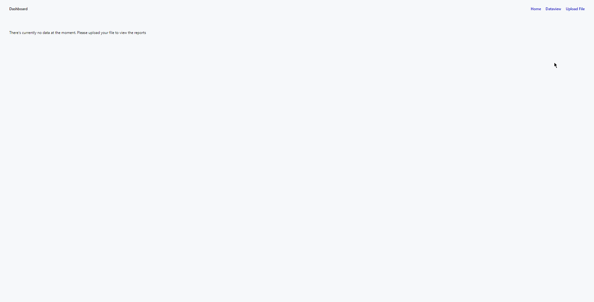

# How to run

Frameworks and impors:
-   Framework Used: Larvel v9
-   PHP Version: 8.1
-   MySQL database Version: 8.0
-   Design pattern: MVC
-   Graphs: Chart JS
-   CSS : Custom CSS
-   jQuery

To run this application follow these steps:
-   Clone the project
-   cd into the Dashboard directory
-   run `composer install`
-   create a copy of the `.env.exanple` file and rename it to `.env`
-   in the `.env` file, please change:
    -   DB_CONNECTION=mysql
    -   DB_HOST= `<Your DB host>` ~ usually `localhost`
    -   DB_PORT= `<Your DB Port>`
    -   DB_DATABASE= `<Your DB name>`
    -   DB_USERNAME= `<Your DB Username>`
    -   DB_PASSWORD= `<Your DB Password>`
-   run `php artisan key:generate`
-   run `php artisan migrate`
-   run `php artisan serve`

# Things I am proud of
-   With the data that I got I was able to create a dashboard that showed all the graphs as well as allowing the line and bar graph to be filtered by the years currently in the database. Although I could've used Bootstrap, I opted to show my knowledge in CSS by creating a custom css file. Although due to the time, I couldnn't add media quieries to make it mobile responsive. The web app currently allows you to view reports, show the data in a table view ~ alloing for sorting, searching and filtering. It also allows for deleting records and also adding new singular records.  View the demo below:

# Demo

